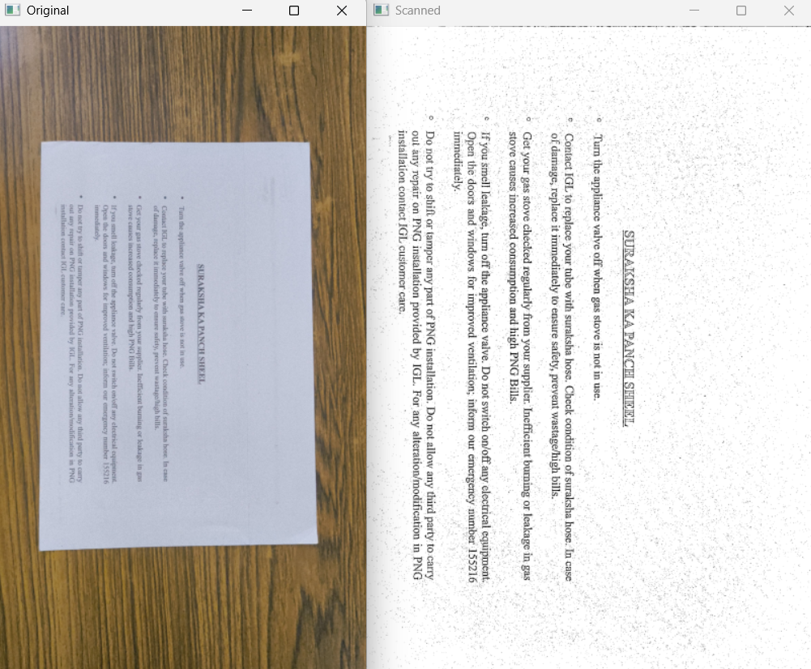

# page_scanner
this is a document scanner using opencv.   
It works best with wooden background

# modules_required
pip install the following
1. pip install scikit-image
2. pip install --upgrade imutils

# how to run
write this in terminal and run
"python main.py --image img.jpg"

# example
this is the output with the given image

